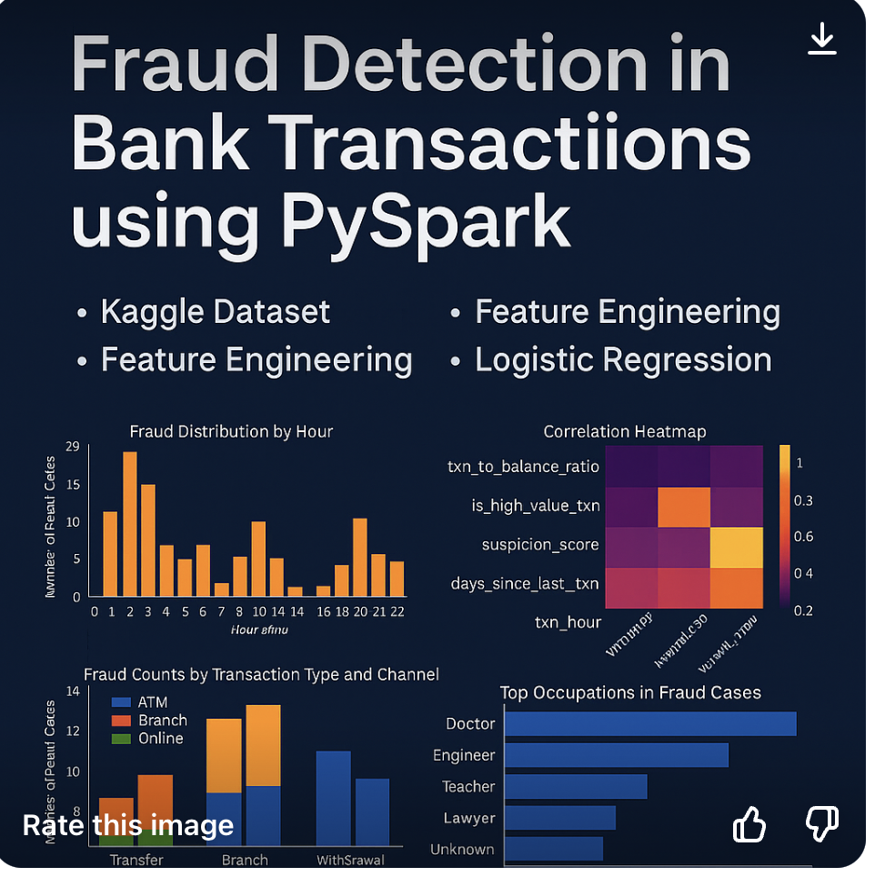

<p align="center">
  
</p>


# 🏦 Fraud Detection in Bank Transactions using PySpark

### Overview
This project demonstrates the use of **PySpark** to detect fraudulent activity in a bank transaction dataset. From feature engineering to machine learning and data visualizations, this end-to-end solution simulates how modern fraud detection pipelines work in production environments.

---

## 📊 Dataset
The dataset used is sourced from **Kaggle**, containing anonymized transaction logs with fields such as transaction amount, type, time, account balance, login attempts, and more.

---

## 🧠 Skills Applied
- PySpark (DataFrame API, SQL, MLlib)
- Databricks Community Edition
- Feature Engineering
- Logistic Regression (MLlib)
- Data Cleaning and Validation
- Matplotlib & Seaborn (for visualizations)
- Git & GitHub

---

## 🔄 Project Pipeline

### ✅ Step 1: Data Ingestion & Schema Validation
- Read raw CSV data using `spark.read.csv()`
- Validated schema and handled all fields as strings initially

### 🔧 Step 2: Data Cleaning
- Casted relevant columns to appropriate types (e.g., `double`, `timestamp`)
- Filled missing values with default values instead of dropping records

### 🧱 Step 3: Feature Engineering
- `txn_to_balance_ratio`: Ratio of transaction amount to account balance
- `days_since_last_txn`: Days between current and previous transactions
- `txn_hour` and `txn_dayofweek`: Temporal patterns
- `suspicion_score`: Based on login attempts, transaction duration, and balance ratio
- Flagged high-risk transactions using `is_fraud_like`

### 📈 Step 4: Exploratory Data Analysis
- Identified top suspicious **AccountIDs**, **txn_hours**, and **Channels**
- Grouped by **MerchantID** to detect potentially compromised vendors
- Aggregated transaction types by average amounts

### 🤖 Step 5: Machine Learning
- Trained a **Logistic Regression model** using engineered features
- Evaluated using Accuracy, Precision, Recall, F1-score

```text
Model Results:
Accuracy: 1.0
Precision: 1.0
Recall: 1.0
F1-score: 1.0

⚠️ Note: Scores are high due to the small and synthetic nature of the dataset.

📊 Step 6: Data Visualization
Bar charts and heatmaps for fraud patterns

Analyzed fraud distribution by time, type, channel, and occupation

💡 Insights
Most fraud-like activities occurred during late hours (16-18)

ATM and Online were the most frequent fraud channels

Certain MerchantIDs had disproportionately higher fraud counts

Transactions with txn_to_balance_ratio > 1 and short durations were highly suspicious

🚀 How to Run
Clone the repository  :--
git clone https://github.com/nikhil-raavi/fraud-detection-bank-transactions.git

Install dependencies :--
pip install -r requirements.txt

✅ Summary
This project simulates a fraud detection pipeline similar to real-world implementations at financial firms. The approach combines data cleaning, advanced feature extraction, anomaly detection patterns, logistic regression, and interactive visualizations — all within the PySpark and Databricks ecosystem.

💬 Support & Contribution
Feel free to fork, modify, and use the code. If you find this project helpful, give it a ⭐ on GitHub!

For feedback, suggestions, or collaborations, reach out via the Issues section.


